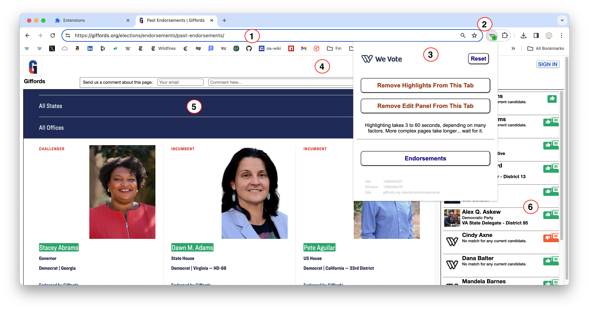
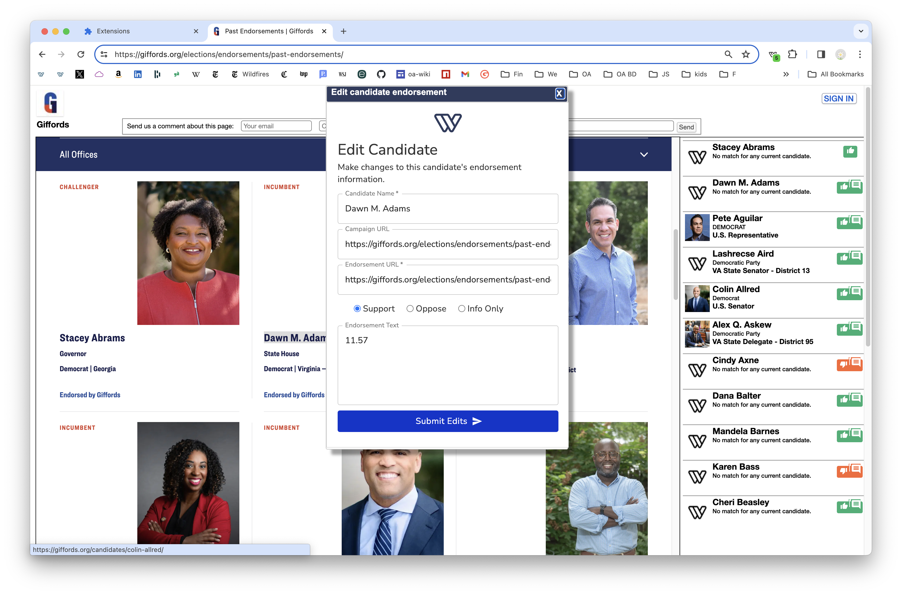

# We Vote Chrome Extension for Endorsement Maintenance and Discovery

This code base was forked from [Highlight This: finds and marks words](https://chrome.google.com/webstore/detail/highlight-this-finds-and/fgmbnmjmbjenlhbefngfibmjkpbcljaj?hl=en)
with many thanks to, and the permission of, [Wim Deboel](http://deboel.eu/).

## For developers

1. Simply fork this repository
2. Open [chrome://extensions/](chrome://extensions/) 
3. Turn on Developer mode in the upper right corner
4. Click the "Load unpacked", and select the root directory of the repository ... something like /Users/stevepodell/WebstormProjects/WeVoteExtension
5. And the We Vote icon should appear in the top toolbar of chrome
  
6. Clicking the "background page" link opens a chrome devtools instance that can be used to 
debug your "Foreground Content Script" (Foreground scripts are the only component of an extension that has access to the web-page's DOM).

[//]: # (7.  **Unfortunately you will need to manually add the Chrome ID for your installation into the code.**)

[//]: # (These Chrome IDs stay stable for your machine over time, and feel free to leave your id in the checked in code.)

[//]: # (    )
[//]: # (    As of November 2023, when you try to run the extension, a message will appear in the )

[//]: # (console log for your endorsement page that will say something like)

[//]: # (    )
[//]: # (   `Message ignored due to unknown sender id: pxxxxxggdjnjhdlhgpfcafbkghyyyyyai`)

[//]: # ()
[//]: # (    Copy this "sender id" &#40;Chrome extension id&#41; and in tabWordHighlight.js at about line 140, add your id as another line)

[//]: # (    in the "if" condition.)

[//]: # (8. Next time you reload the extension it should allow messages to be sent and received between diferent execution environments of the extension &#40;more on this later&#41;.)
9. At this point the extension should be working on your dev setup.

Notes:

* That "Errors" button on the [chrome://extensions/](chrome://extensions/) shows some code validation errors, and some
runtime errors.  It can be useful, but not as useful as the "background page" devtools.
* Errors like `Unchecked runtime.lastError: The message port closed before a response was received.` can usually be 
ignored.  I believe that when the pop-up closes before its last message to the background is completed with a response (which is usually not important) you get this message.

## Files:

<!--
fileArchitectureDrawing.png
https://docs.google.com/drawings/d/1C32qtyMrsqAZXxN7TEG3lryZXn56owVHnZhwxoAAOLo/edit?usp=sharing 
-->

There are three execution environments:  the "Content Foreground" the "ServiceWorker" and the "Pop-up" (as shown in 3 top boxes in the drawing).
These are somewhat independent of each other, but can communicate via messages that are part of Chrome's extension infrastructure.

In addition, there are 3 "common" files that are included into each of the 3 execution places, but they
are copies at execution time, so state should not be set in these common files, and if state were to be set, 
it would be invisible in the other 2 execution environments.

### The three code execution environments
1)  The Popup DOM (a.k.a. the Background Pop-up)

    Chrome provides the infrastructure to add a popup ui triggered by the icon to the right of the chrome action bar.  Our pop-up allows
    you to Highlight candidates on an endorsement page, and to open the endorsement page in a iframe on the left hand side with  a right panel that has details of the endorsement.  This code is kicked off via the popup.html file.

    *Communications:*  The pop-up can only communicate with the service-worker.
2) The service worker

   A service worker is like a proxy server that allows communications between the pop-up and the foreground DOM.  It also allows
   communications with the Chrome extension infrastructure -- an example is updating the highlight count in the
   green bubble on the "W" wevote Chrome extension button to the right of the action bar.

   *Communications:*  The service worker can make API calls to remote servers and can send and receive messages with the popup and the foreground.
3) The foreground DOM

   The foreground DOM, before the extension starts up, is simply the DOM of the endorsement page, for example [Giffords](https://giffords.org/elections/endorsements/past-endorsements/).
   As the extension starts, the WeVote Chrome extension adds all the files in the js/contentForeground directory to that DOM,
   and starts running our code.
   
   Our extension implementation does have the ability to open dialogs in the foreground, that contain an iframe that displays very specific pages in the WebApp for editing or creating new endorsements.
   An example is `WebApp/src/js/pages/Ballot/EditCandidateForExtension/EditCandidateForExtensionForm.jsx`

   *Communications:*  The WeVote extenion code running in the foreground, can send and receive messages with the service-worker, but can not directly communicate with API servers. 

### The on-screen Components

With the extension running in show "Edit Panel" mode on the example page [Giffords](https://giffords.org/elections/endorsements/past-endorsements/)
The components are:
1) The Chrome "action bar" (URL entry field)
2) The WeVote Chrome Extension "W" icon, to invoke the popup
3) The pop-up
4) In "Edit Page" mode, the top panel containing the endorser logo, a comments dialog, and the 'SIGN IN' button.
5) The main DOM, containing the endorsement page. In this example Giffords and showing 3 candidates
with their names highlighted in green.  The highlighting is created by this extension by adding some markup
to the endorsement page's DOM.
6) The "right pane", which contains possible endorsements -- clicking on one of these endorsements opens up
an in-line editing dialog for adding more information about the candidate.
7) The modal dialog for editing an endorsement is opened by right clicking on an highlighted candididate on the endorsement
page, or selecting some text (a new to WeVote candidate) and right clicking on that selection to open the dialog shown below.

### Craziness
* JavaScript is single threaded, but in an extension we are dealing with at least three threads of execution, and there really are no good tools 
to diagnose threading issues.  So sometimes simple problems that might take minutes to resolve in a thread aware language like Java
takes a day to resolve, and the fix usually involves a workaround for some simple bit of code that is so elementary that it should be working.
* When you see a log line with 'VM' in front of the file name on the right, you are in wierd thread land.
* There are 2 DOMs involved, and the latest Chrome Dev Tools debugger is getting better at allowing you to figure out the complexites.
* Timing is a big mess.  Some pages take longer to load than others, and some pages unexpectedly rewrite the area that we are writing to, thereby erasing our added markup.  

### Black Magic
1) If making changes to popup.js or popup.html, you need to "Remove" the extension from chrome://extensions/ in order for
the changes to take effect.
2) Everytime you reload the extension with the circular reload arrow button, you need to do a hard reload of the test endorsement page you are working with.  Otherwise, it will not see the changes.

### Debugging notes
* It seems that the more tabs you have open in Chrome, even if they are in different windows, the slower the extension runs.  This is also true in the released versions.
* The (otherwise excellent) Chrome Dev Tools debugger, gets confused with extensions.  
* Usually you will have to press the refresh (circular arrow icon) on the extension tab, to load the
latest version of the extension code.

* Then you will need to update the tab where you are debugging the extension, the Hard Reload might be all you
need with 'Shift+Option+R', but it always does the job with the "Empty Cache and Hard Reload"
(which will only be present if you are using the debugger on that tab.) 

Resources leak:
* The (still otherwise excellent) Chrome Dev Tools debugger, appears to leak resources when you do a hard refresh
while it is stopped at a breakpoint.  The symptoms are the tab becomes slower to load, and eventually becomes non-responsive.  When this happens close the tab, and reload it using Chrome's History/Recently Closed
menu item.

## Publishing an Update

[See the Chrome doc](https://developer.chrome.com/webstore/publish)

[Create a new zip file](https://developer.chrome.com/apps/hosting)

In macOS, in finder, just select your working directory (something like `/Users/stevepodell/WebstormProjects/EndorsementExtension
`) right click on it, and choose `Compress "Endorsement Extension"` which creates an `EndorsementExtension.zip` file.

If that zip file is not accepted by Chrome Web Store Developer Dashboard, you can manually make the zip file:

    stevepodell@Steves-MBP-M1-Dec2021 EndorsementExtension % cd ..
    stevepodell@Steves-MBP-M1-Dec2021 WebstormProjects % zip -r EndorsementExtension.zip EndorsementExtension

Get the login credentials for chrome@wevoteeducation.org from Dale.

Login to the Chrome developer console [https://chrome.google.com/webstore/developer/edit/eofojjpbgfdogalmibgljcgdipkhoclc?authuser=3](https://chrome.google.com/webstore/developer/edit/eofojjpbgfdogalmibgljcgdipkhoclc?authuser=3)

May 2020: The boilerplate needed for the "new chrome store website", you will have to type this in for each release.

And at the very bottom of the page, press the `Publish changes` button.  And press `Ok` on the confirm dialog.  Then you
will see a dialog that says something like "Your item is in the process of being published and may take up to 60 minutes to appear in the Chrome Web Store." -- Then you are done.

### Note May 2020

**Do not release a new version from the new console, it makes a completely new chrome store entry with a new id, 
which will not match **
            if (sender.id === 'pmpmiggdjnjhdlhgpfcafbkghhcjocai' ||
                sender.id === 'lfifjogjdncflocpmhfhhlflgndgkjdo' ||
                sender.id === 'eofojjpbgfdogalmibgljcgdipkhoclc' ||
                sender.id === 'highlightthis@deboel.eu') {

**And therefore will not work (the chrome store auto-releases new versions) also since it has a new ID, the installed base
will not receive the updates automatically.

On the [Chrome Store Dev Console](https://chrome.google.com/u/2/webstore/devconsole/a50353be-1bec-4452-b8e4-c5fd9f2f6336/eofojjpbgfdogalmibgljcgdipkhoclc/edit/package?hl=en)
go to the **Package** tab on the left side menu, to replace the current release.

## Testing: Deleting a possibility that was made from the left pane
Voter Guide endorsements can be in the "Possibilities" state (Recommended by a voter or a WeVote power volunteer), or "Stored"
for those that we are more sure about.  This Chrome extension displays both kinds as highlights on the original page (in the left pane), 
and as a list in the right pane. "Possibilities" will have less data, and will not have WeVoteCandidateIds, so the link to
the webapp won't work for them.

In the left pane, right-clicking, and then choosing "Create We Vote Endorsement", creates a new "Possibility", which
are in a different table on the server, and are accessed in a different way in the menus.

From the Voter Guide menu in the Admin Interface (Python Templates) on the API server, select "Review Voter Guide 
Possibilities"

You can use <table> tag to create tables without header.

   
Then search for the organization's endorsement page.  

   

The search is a bit dodgy (September 21, 2019) and you might get lots
of extraneous results, plus some older endorsement pages, so  you might have to find the one you are interested in by
trial and error.  To choose one, don't click on its name, click on the green "Edit" button. 

   

When you get to the page, in this example, we are selecting Christy Smith for deletion, by 
clicking the checkbox to the right.

Finally, scroll to the bottom, and DO NOT press 'Delete' that deletes the entire voter guide possiblity record,
 including all the voter guide possibility position records.  Instead, press "Analyze & Save",
 to delete Christy's position possibility record.
  
 

